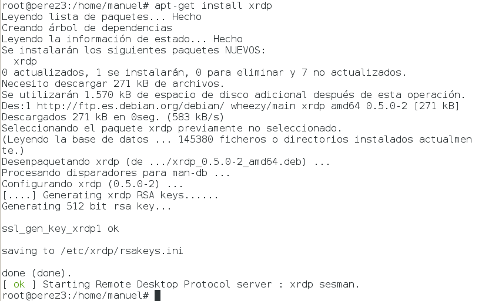
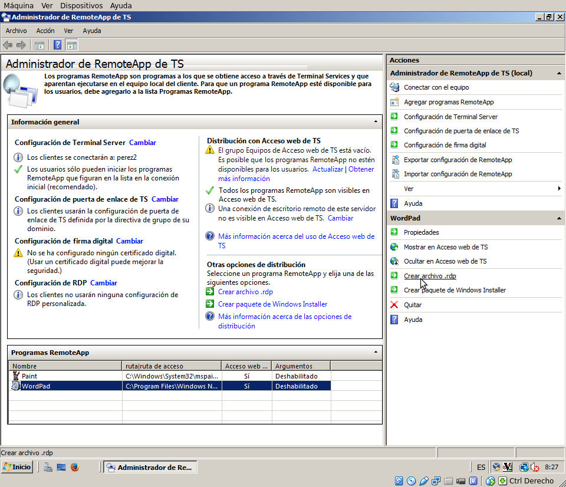

# Administración de sistemas operativos

# Práctica 1.04 - Acceso remoto

## Integrantes del grupo: Manuel Pérez Acosta y Héctor Pedraza Aguilar

## 1. Introducción

El objetivo de la práctica es utilizar las herrmientas de escritorio remoto para acceso a distintos sistemas operativos desde máquinas remotas. Implementaremos conexiones tanto VNC como RDP, además del servidor de terminales ("Terminal services") de windows. Para concluir, implantaremos un servidor de aplicaciones remotas con RemoteAPP.

La práctica será realizada en grupos, comprobando los resultados con accesos concurrentes en cada caso implementado.

Para el desarrollo de la práctica utilizaremos 3 máquinas virtuales por cada componente del grupo: una máquina windows 7, otra windows 2008 server y una última linux, que en nuestro caso será debian 7.

## 2. Escritorio remoto con VNC

### De windows a windows

Para esta parte de la práctica comenzamos utilizando la herramienta RealVNC, aunque descartamos su uso cuando en una fase de la instalación le herramienta solicita registro para su completo uso. Por tanto, hemos cambiado a la herramienta TightVNC para la realización de la práctica.

Empezaremos instalando la herramienta en windows. Descargamos el programa y lo instalamos. Podemos instalar el servicio y el cliente conjuntamente o bien instalar el servicio y utilizar un instalador ejecutable. En nuestro caso optaremos por esto último: instalaremos el servicio en la máquina windows 2008 server y el cliente ejecutable en la máquina windows 7.

Instalamos primero el servicio. Ejecutamos el instalador (descargado de la página oficial) e introducimos las claves de uso del programa.

Ahora instalamos la máquina virtual java, requerida por el cliente TightVNC ejecutable.

Ejecutamos el cliente, ponemos la dirección de la máquina que queremos acceder remotamente y accedemos. Dentro de la máquina remota  abrimos una consola y ejecutamos el comando `netstat` para comprobar las conexiones que tiene la máquina.

### De linux a windows

Ahora vamos a seguir el mismo procedimiento en la máquina debian.

Utilizaremos la misma herramienta, por lo que la instalamos mediante el comando `apt-get install tightvncserver`

Cuando termine de instalar, lo ejecutamos para establecer las contraseñas del programa, igual que hicimos en windows.

Una vez que tengamos instalado el servicio, instalamos el cliente VNC mediante el comando `apt-get install xtightvncviewer`

Ejecutamos el programa y le indicamos dirección ip y contraseña de la máquina windows server para conectarnos a ella. Cuando estemos dentro ejecutamos el `netstat` para comprobar las conexiones de la máquina.

### De linux a linux

Para poder conectar a la máquina linux tenemos que crear una ventana de conexión, donde especificamos tamaño y profundidad de colores. Para crearla ejecutamos `tightvncserver :1 -geometry 800x600 -depth 24`

> **Nota**: podemos crear tantas ventanas de conexión como queramos. Si queremos borrar alguna tenemos que ejecutar el comando tightvncserver -kill :1`

Ahora ejecutamos el xtightvncviewer e indicamos la ruta de la máquina debian a la que queremos conectar y la contraseña. Cuando conectemos, ejecutamos el comando `netstat -ntap` para las comprobaciones.

### De windows a linux

Para terminar realizamos la misma conexión desde la máquina windows a la máquina debian. Ejecutamos el cliente en windows y conectamos a la máquina debian remota. Volvemos a ejecutar el comando `netstat -ntap` para las comprobaciones.

## 3. Escritorio remoto con RDP

En este apartado vamos a realizar las conexiones remota mediante el protocolo RDP. La herramienta que utilizaremos ya viene preinstalada con los sistemas windows ("Conexión a Escritorio Remoto") por lo que solo tendremos que dar permiso de acceso, mientras que en debian tendremos que instalar la herramienta que vamos a usar.

### Acceder a windows 7 desde windows server

Para permitir las conexiones remotas en windows 7 tenemos que ir a `Inicio --> Click derecho en equipo --> Propiedades --> Configuración de acceso remoto` (`Panel de control --> Sistema --> Configuración de acceso remoto`).

Una vez permitida la conexión probamos a establecerla.

### Acceder a windows 7 desde linux

Para acceder desde linux necesitamos un cliente de acceso remoto que utilice el protocolo RDP. En nuestro caso hemos escogido la herramienta "remmina".

Ejecutamos el programa, ponemos los parámetros de conexión y probamos a conectar.

### Acceder a Linux desde windows 7

Para poder acceder a linux tenemos que instalar un servicio que utilice el protocolo RDP, ya que no viene ninguno instalado por defecto con el sistema. En nuestro caso utilizaremos la herramienta "xrdp". `apt-get install xrdp`.

Una vez instalada ejecutamos la Conexión a Escritorio Remoto de windows 7 y conectamos con la máquina debian.

## 4. Servidor de terminales

Esta parte de la práctica es sólo para windows. Para poder instalar el servidor de terminales necesitamos que la máquina windows server no sea controlador de dominio, como es nuestro caso. 

Vamos a `Inicio --> Herramientas administrativas --> Administrador del servidor --> Roles (o funciones)` y marcamos la función de "Terminal services".

Seguimos todos los pasos para la activación de la función sin realizar cambios. Cuando termine probamos a establecer conexión desde la máquina windows 7 y la máquina debian simultáneamente.

## 5. Aplicaciones remotas mediante RemoteAPP

Para finalizar la práctica, instalaremos y configuraremos un ejemplo de aplicación remota en el servidor para acceder desde el cliente.
En este apartado lo realizaremos con el servidor Windows 2008 Server y el cliente Windows 7.

En nuestro caso, ya tenemos instalado el acceso remoto a nuestro equipo así que no nos hace falta hacer una instalacioón de roles y características.

Directamente accedemos a `Inicio -> Herramientas administrativas -> Terminal Services -> Administrador de RemoteApp de TS`:

Ahora, dentro del Administrador de RemoteApp, pulsamos sobre el enlace de Agregar Programas RemoteApp y nos abrirá un asistente:

Seleccionamos la aplicación que queremos usar en remoto, en nuestro caso hemos elegido Wordpad y Paint:

Finalizamos la configuración, y si todo ha salido bien, nos debe aparecer en la pantalla principal las dos aplicaciones.

A continuación, elegimos la manera que queremos que el usuario ejecute la aplicación remota, en nuestro caso creamos un archivo de conexión remota `.rdp` y copiamos el enlace en el cliente.

Finalmente accedemos a la aplicación de RemoteApp desde el cliente:

## 6. Conclusiones

En general, ha sido una práctica sencilla y de mucha utilidad en el entorno de la administración de sistemas ya que es imprescindible para una gran empresa hacer uso de estás herramientas de acceso remoto para solucionar los problemas que tengan los usuarios en sus equipos. El uso de conexiones remotas permite reducir los tiempos y costos empleados para realizar tareas específicas en un equipo que se ubica a distancia. El uso de conexiones remotas permite reducir los tiempos y costos empleados para realizar tareas específicas en un equipo que se ubica a distancia. En definitiva, el uso de conexiones remotas permite reducir el tiempo y el coste empleados para realizar tareas específicas en un equipo que se encuentra a distancia.

