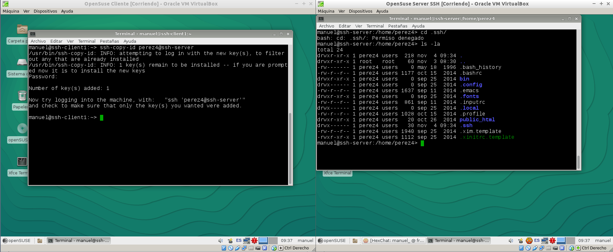

# ACCESO REMOTO SSH

## Introducción

En está práctica, trabajaremos con el protocolo ssh para acceder remotamente desde máquinas clientes hacia un servidor que ofrece el servicio.
Para la realización de dicha práctica necesitaremos 3 máquinas: un servidor GNU/Linux OpenSuse y dos clientes (un GNU/Linux OpenSuse y otro Windows 7).

## 1. Preparativos

### Servidor SSH

En primer lugar vamos a configurar el servidor, para ello le asignamos las configuraciones de red correspondientes.

Accedemos a la herramienta Yast2 y configuramos los parámetros de red:

Ahora ejecutamos varios comandos para comprobar los cambios ejecutados:

Y también añadimos al fichero /etc/hosts los equipos ssh-client1 y ssh-client2:

Para terminar los preparativos del servidor, creamos 4 usuarios con nuestro primer apellido:

### Cliente GNU/Linux

Configuramos los parámetros de red del cliente:

Y añadimos en /etc/hosts los equipos ssh-server y ssh-client2

Por último, hacemos ping entre las dos máquinas para comprobar que todo está bien configurado:

### Cliente Windows

En el cliente Windows, tendremos que instalar el software cliente SSH, en este caso, la herramienta PuTTY:

Ahora configuramos los parámetros de red de la máquina:

Ponemos como clave del Administrador el DNI:

Y añadimos en C:\Windows\System32\drivers\etc\hosts el equipo ssh-server y ssh-client1:

Por últimos hacemos ping entre los dos equipos para comprobar que todo está bien configurado:

## 2. Instalación del servicio SSH

Vamos a instalar el servicio SSH en la máquina server, en mi caso, desde la terminal.

Al ejecutar el comando, nos damos cuenta de que ya está instalado el paquete.

### Comprobación

Ahora desde el **ssh-server**, verificamos que el servicio está en ejecución, y sino lo iniciamos nosotros con el comando `systemctl status/start/stop/restart sshd`:

### Primera conexión SSH desde el cliente

Lo primero que hacemos es comprobar el cortafuegos y ponemos como servicio autorizado el ssh:

Y ahora comprobamos el acceso mediante ssh desde los clientes, comprobamos que se produce el intercambio de claves:

Comprobamos el contenido del fichero /.ssh/known_hosts en el equipo ssh-client1 (la clave que aparece es la clave de identificación de la máquina server):

### ¿Y si cambiamos las claves del servidor?

En este punto, vamos a modificar el fichero de configuración SSH (/etc/ssh/sshd_config) y descomentamos la línea HostKey /etc/ssh/ssh_host_rsa_key:

Generamos nuevas claves en el server y reiniciamos el servicio SSH. A continuación, comprobamos que sucede al volver a conectarnos desde el cliente:

Ahora borramos la clave del cliente y nos conectamos de nuevo para que se produzca el intercambio de claves otra vez:

## 3. Personalización del prompt Bash

En este punto vamos a personalizar el aspecto de la consola para un usuario, para ello, modificamos el fichero .bashrc del usuario:

Y además creamos el fichero .alias con el siguiente contenido:

Hacemos la comprobación:

## 4. Autenticación mediante claves públicas

En este apartado vamos a configurar SSH para poder acceder desde el ssh-client1 usando el usuario 4 sin poner el password pero usando claves pública/privada. 
Vamos a configurar la autenticación mediante clave pública para acceder con nuestro usuario personal desde el equipo cliente al servidor con el usuario 1er-apellido-alumno4.

En primer lugar, iniciamos sesión con nuestro usuario y ejecutamos `ssh-keygen -t rsa` para generar un par de claves para el usuario:

Ahora vamos a copiar la clave pública (id_rsa.pub) del usuario de la máquina cliente al fichero `authorized_keys` del usuario perez4 en el servidor, para ello, yo he usado el comando `ssh-copy-id perez4@ssh-server`

Y accedemos sin escribir el password:

Pero desde el cliente2 si que lo pide:

## 5. Uso de SSH como túnel para X

## 6. Aplicaciones Windows nativas

## 7. Restricciones de uso

### Sin restricción (tipo 1)

### Restricción total (tipo 2)

### Restricción en las máquinas (tipo 3)

### Restricción sobre aplicaciones (tipo 4)
