# Samba - OpenSUSE

## Introducción

Para la realización de esta práctica vamos a necesitar 3 máquinas virtuales: Un Un servidor GNU/Linux y dos clientes, uno GNU/Linux y otro Windows 7. En este caso, utilizaremos el sistema operativo OpenSuse.

## Preparativos

Configuramos el servidor con el mi nombre de usuario, la clave (DNI), nombre del equipo (samba-server) y añadimos al fichero `/etc/hosts` los dos clientes:

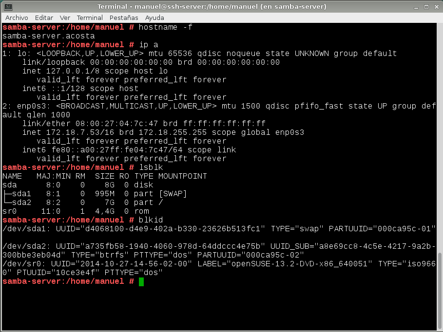

## Usuarios locales

Ahora vamos a crear los grupos y los usuarios que utilizaremos en la práctica, en mi caso, he utilizado el entorno gráfico a través de la herramienta Yast de OpenSuse.

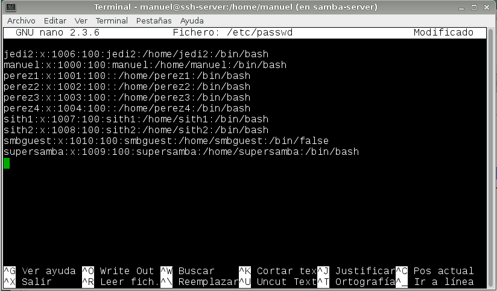

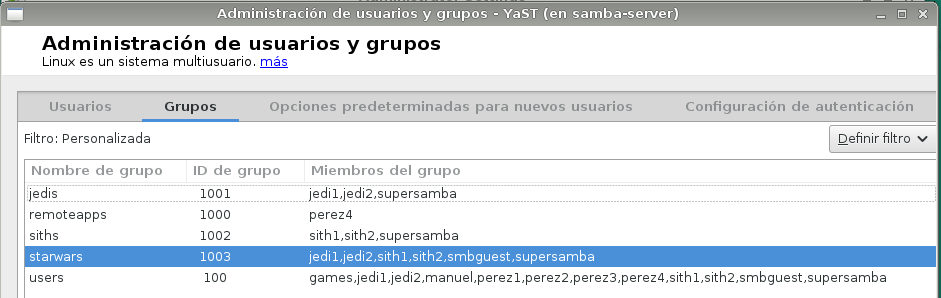

## Instalar Samba

A continuación, instalamos el servicio Samba:

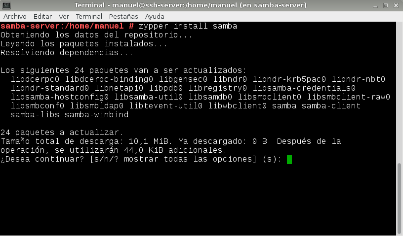

## Crear las carpetas para los recursos compartidos

Luego, después de instalar Samba, vamos a crear las carpetas de los recursos compartidos con los siguientes permisos dentro de `/var/samba`:

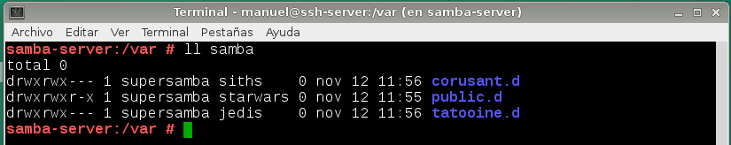

## Configurar Samba

En este apartado, vamos a configurar el servidor Samba. Primero hacemos una copia de seguridad del fichero de configuración y luego accedemos a la herramienta Yast.

En las siguientes imágenes se muestra todo el proceso:

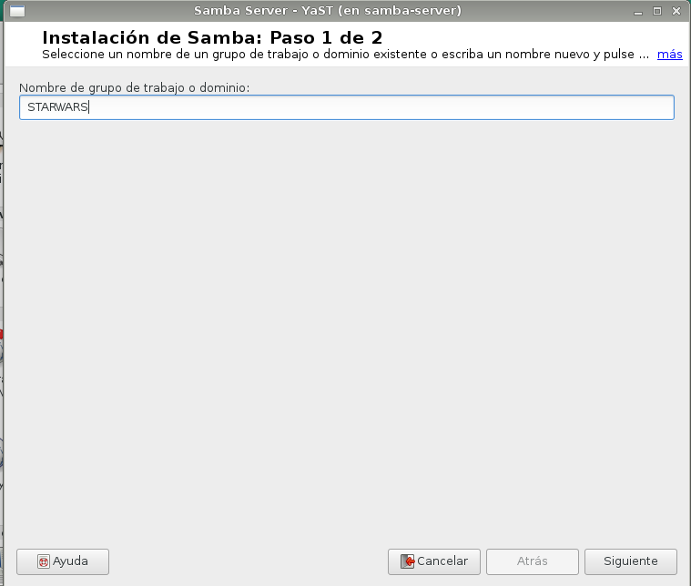

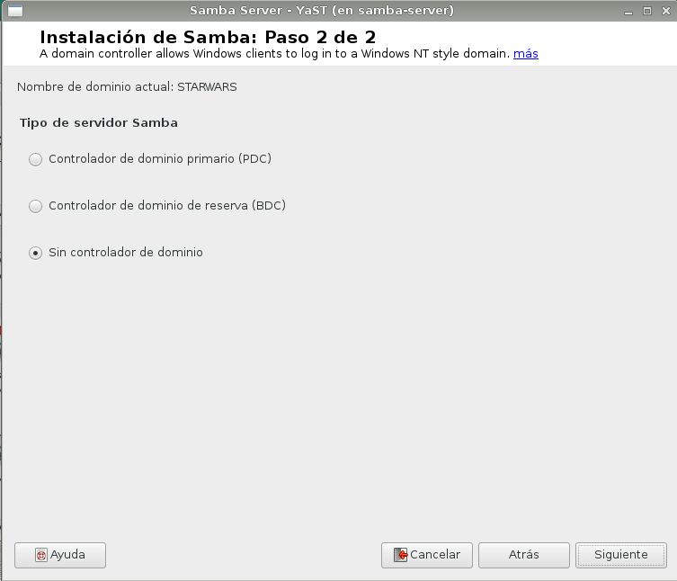

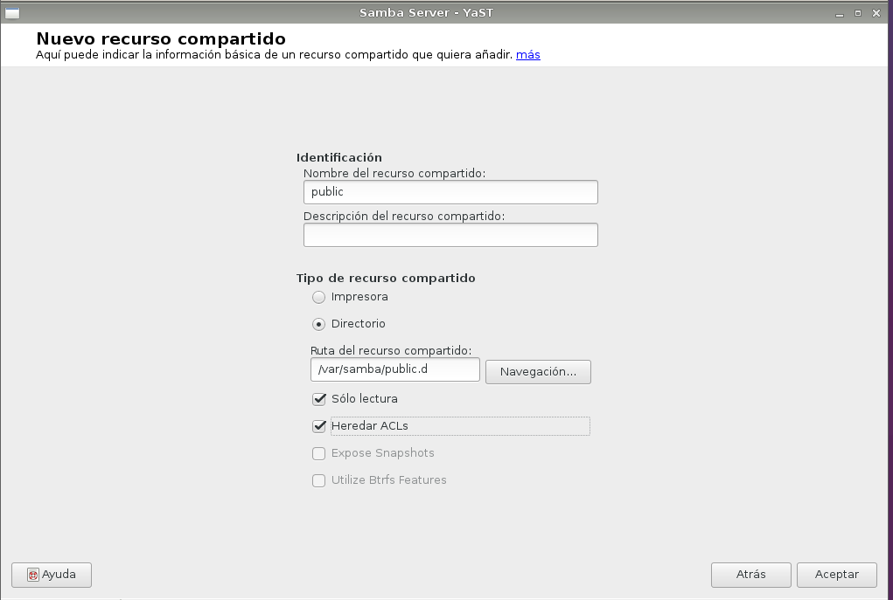

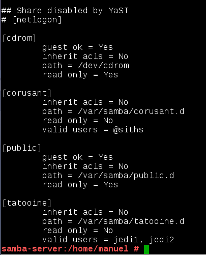

## Usuarios Samba

Después de crear los usuarios en el sistema, hay que añadirlos a Samba utilizando el comando `smbpasswd -a nombreusuario`. Después de añadirlos, lo comprobamos con el siguiente comando:

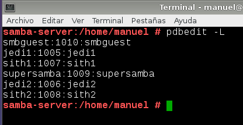

## Reiniciar

Ahora reiniciamos el servicio Samba y comprobamos el estado:

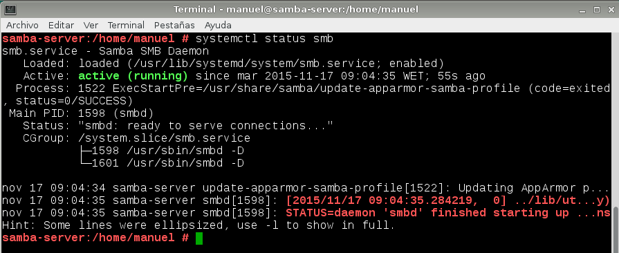

Y comprobamos con los siguientes comandos:

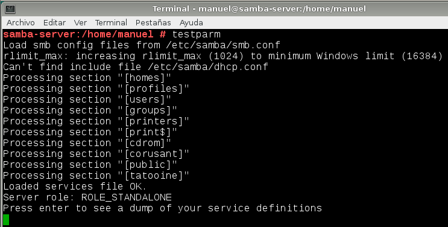

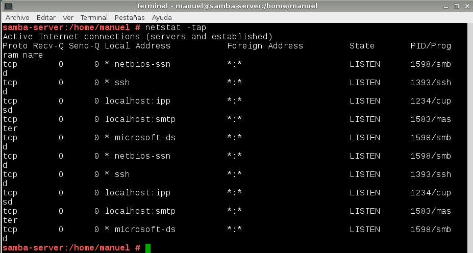

# Windows

## Cliente Windows GUI

## Cliente Windows comandos

# Cliente GNU/Linux

## Cliente GNU/Linux GUI

## Cliente GNU/Linux comandos

## Montaje automático

# Preguntas para resolver
