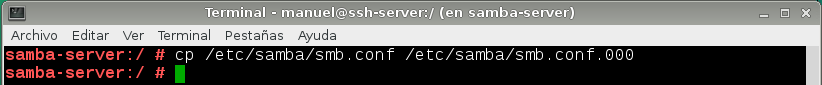
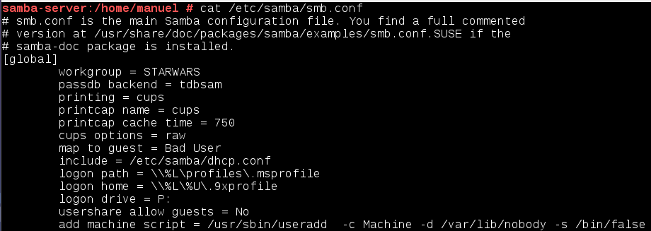
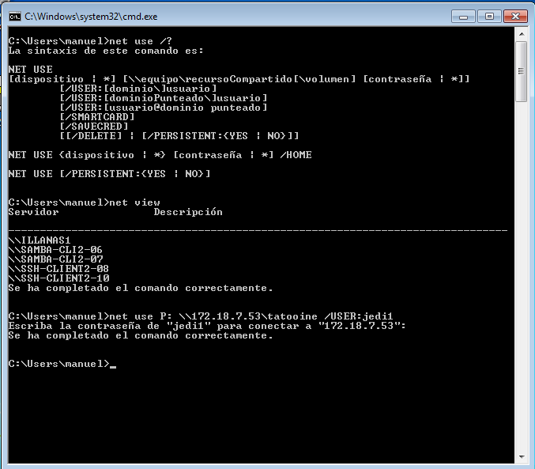

# Samba - OpenSUSE

## Introducción

Para la realización de esta práctica vamos a necesitar 3 máquinas virtuales: Un Un servidor GNU/Linux y dos clientes, uno GNU/Linux y otro Windows 7. En este caso, utilizaremos el sistema operativo OpenSuse.

## Preparativos

Configuramos el servidor con el mi nombre de usuario, la clave (DNI), nombre del equipo (samba-server) y añadimos al fichero `/etc/hosts` los dos clientes:

## Usuarios locales

Ahora vamos a crear los grupos y los usuarios que utilizaremos en la práctica, en mi caso, he utilizado el entorno gráfico a través de la herramienta Yast de OpenSuse.

## Instalar Samba

A continuación, instalamos el servicio Samba:

## Crear las carpetas para los recursos compartidos

Luego, después de instalar Samba, vamos a crear las carpetas de los recursos compartidos con los siguientes permisos dentro de `/var/samba`:

## Configurar Samba

En este apartado, vamos a configurar el servidor Samba. Primero hacemos una copia de seguridad del fichero de configuración y luego accedemos a la herramienta Yast.

En las siguientes imágenes se muestra todo el proceso:

## Usuarios Samba

Después de crear los usuarios en el sistema, hay que añadirlos a Samba utilizando el comando `smbpasswd -a nombreusuario`. Después de añadirlos, lo comprobamos con el siguiente comando:

## Reiniciar

Ahora reiniciamos el servicio Samba y comprobamos el estado:

Y comprobamos con los siguientes comandos:

# Windows

## Cliente Windows GUI

En este apartado de la práctica, trataremos de acceder a los recursos compartidos en el servidor Samba desde un cliente Windows. Comprobaremos todos los accesos posibles como si fuéramos un `sith`, un `jedi` o un invitado.

## Cliente Windows comandos

En el cliente Windows, para consultar todos los recursos conectados hacemos `> net use`. En la siguiente imagen se muestra el proceso que hemos seguido para ver la máquinas accesibles en la red y para conectarnos a nuestra máquina servidora:

Comprobamos el estado:

# Cliente GNU/Linux

## Cliente GNU/Linux GUI

Desde el entorno gráfico, podemos acceder a los recursos compartidos SMB/CIFS. Accedemos escribiendo `smb://172.18.7.53`:

Probamos a entrar en la carpeta tatooine y creamos una carpeta:

Y ahora, comprobamos que la carpeta public es de sólo lectura:

Y comprobamos el estado del servidor:

## Cliente GNU/Linux comandos

Ahora, mediante comandos, vamos a montar un recurso compartido en una carpeta local del cliente:

Después de montar, comprobamos:

Comparamos el servidor y el cliente:

Y comprobamos el estado:

## Montaje automático

En el apartado anterior, hemos realizado el montaje de forma manual, pero para configurar las acciones de montaje de manera automática, configuraremos el fichero `/etc/stab`; de esta manera, cada vez que iniciemos el equipo se montará de manera automática.

# Preguntas para resolver

* ¿Las claves de los usuarios en GNU/Linux deben ser las mismas que las que usa Samba? No, las claves pueden ser diferentes.
* ¿Puedo definir un usuario en Samba llamado sith3, y que no exista como usuario del sistema? No, para crear un usuario de samba debemos utilizar el comando smbpasswd, pero antes debemos haber creado el usuario en el sistema. 
* ¿Cómo podemos hacer que los usuarios sith1 y sith2 no puedan acceder al sistema pero sí al samba? (Consultar `/etc/passwd`) Posiblemente con el uso de las listas de control de acceso (ACL).
* Añadir el recurso `[homes]` al fichero `smb.conf` según los apuntes. ¿Qué efecto tiene? Nos permitirá compartir las carpetas home de cada usuario, para que cada usuario pueda acceder a su carpeta home por la red.

