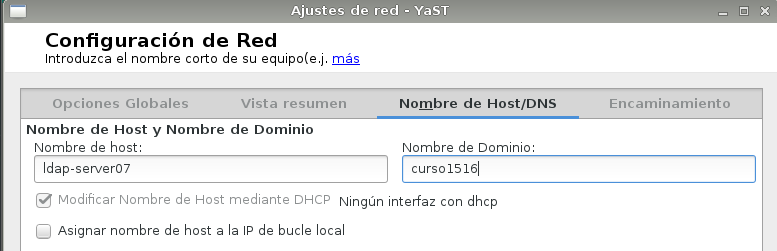
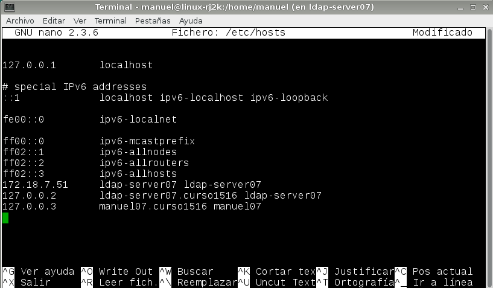
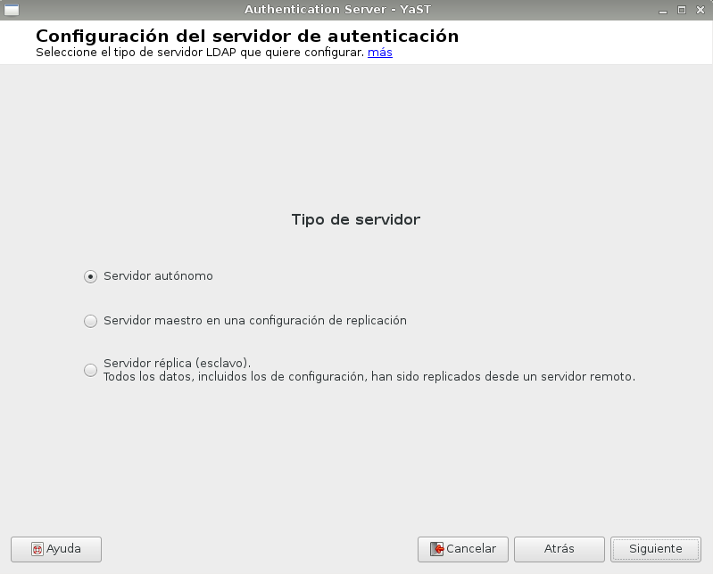
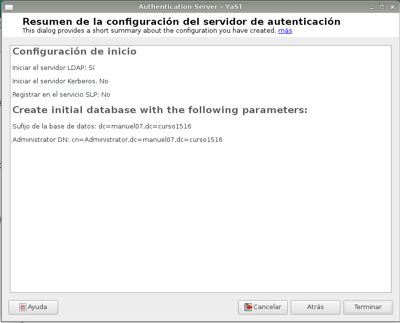
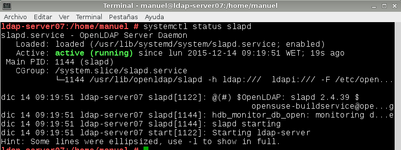
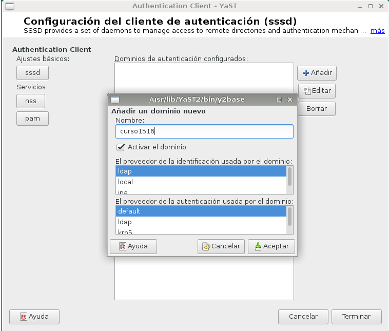
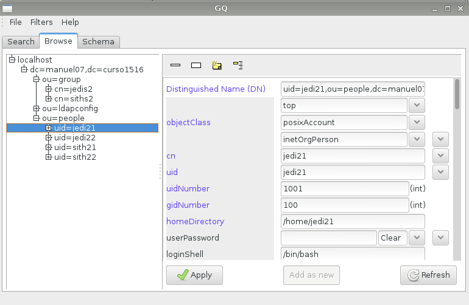

# LDAP - OpenSuse

## 1. Servidor LDAP

### 1.1 Preparar la máquina

Comenzamos con la instalación del servidor LDAP. En primer lugar configuraremos los parámetros de red asignándole una IP estática, el nombre del equipo correspondiente así como el dominio:

Y además, añadiremos algunas entradas al fichero `/etc/hosts`:

Para hacer la comprobación de que todo está correctamente configurado, ejecutamos los siguientes comandos:

### 1.2 Instalación del Servidor LDAP

En este apartado de la práctica, procederemos a la instalación del módulo de Yast para gestionar el servidor LDAP `yast2-auth-server`.

Una vez instalado el módulo en el panel de Yast seguiremos los siguientes pasos:

* Ir a Yast -> Servidor de autenticación -> Iniciar

* Tipo de servidor -> Autónomo

* Configuración TLS -> No habilitar

* Usar como nombre de dominio `dc=manuel07,dc=curso1516`

* No habilitar Kerberos

* Comprobamos la configuración final:

Una vez instalado, comprobamos el servicio con el comando `systemctl status slapd`:

Luego, instalaremos la herramienta `gq` para comprobar el contenido de la base de datos LDAP. Vemos que ya tenemos las unidades organizativas: `groups` y `people`:

### 1.3 Crear usuarios y grupos en LDAP

Ahora procederemos a la instalación del paquete `yast2-auth-client` que nos configurará la máquina para autenticación. Una vez instalado, accedemos a `Cliente de autenticación` a través del panel de Yast y añadimos nuestro dominio:

Aceptamos y a continuación añadimos el parámetro LDAP URI:

Ahora procedemos a la creación de usuarios y grupos de LDAP:

Y comprobamos mediante el browser LDAP `gq` la información que tenemos en la base de datos LDAP:

### 1.4 Autenticación

* Comprobamos que podemos entrar desde la consola en la máquina server `ldap-server07` usando los usuarios definidos en la base de datos LDAP:

