# Tareas programadas - OpenSuse

## 1. SO OpenSuse

### 1.1 Configuración de la máquina

Antes de comenzar la práctica, configuramos los parámetros de red de la máquina y ejecutamos los siguientes comandos:

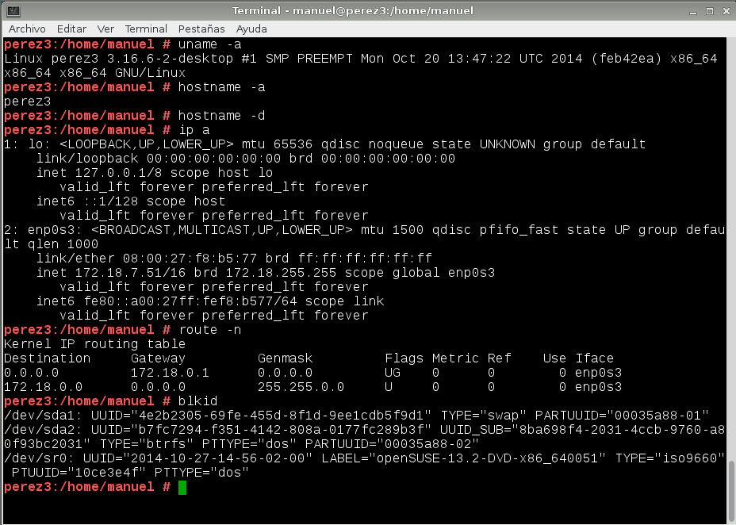

### 1.2 Tarea diferida

En este apartado, vamos a realizar un ejemplo de tarea programada diferida con el comando `at`. Como por ejemplo apagar el equipo o mostrar un mensaje por pantalla. Previamente el servicio `atd` tiene que estar en ejecución.

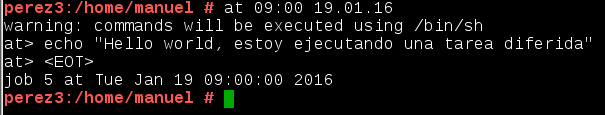

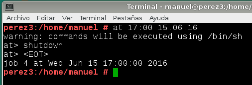

### 1.3 Tarea periódica

Ahora vamos a hacer un ejemplo de tarea programada periódica con `crontab`. Para ello, accedemos al fichero `/etc/crontab` y dentro escribimos la línea correspondiente. En mi caso, voy a realizar una actualización en el sistema. 

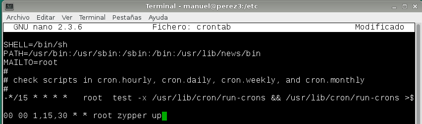

### 1.4 Tarea asíncrona

Por último, realizaremos un ejemplo de tarea asíncrona. Elegimos una tarea útil para el sistema como programar una copia de backup y para definirla, ponemos el script en el fichero `/etc/cron.hourly`:

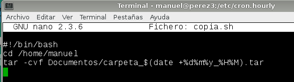

## 2. Windows 7

En Windows 7 para iniciar el programador de tareas accedemos a través del `Panel de control -> Herramientas administrativas -> Programador de tareas`.

### 2.1 Configuración de la máquina

En este apartado realizamos las configuraciones de red correspondientes para el correcto funcionamiento de la práctica como muestra en el enunciado de la misma.

### 2.2 Tarea diferida

Hacemos un ejemplo de tarea programada diferida para ordenar el apagador de la máquina.

"Pinchamos" en `Crear tarea` y una vez dentro de la ventana navegamos por las pestañas:

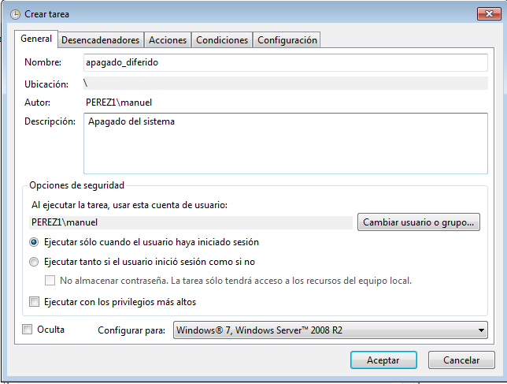

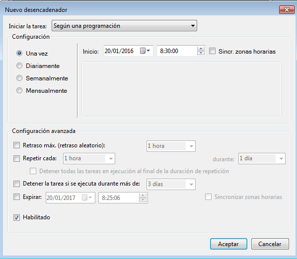

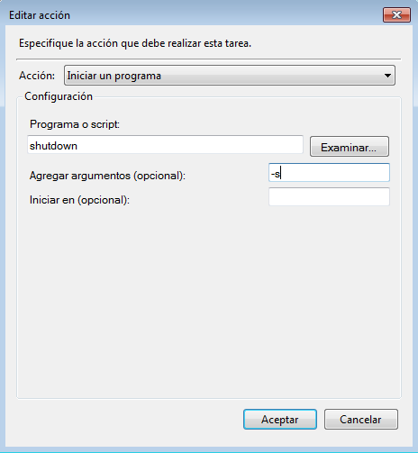

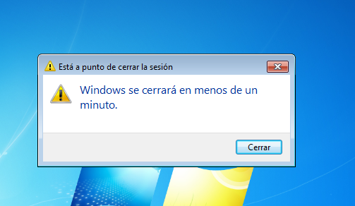

### 2.3 Tarea periódica

En este apartado creamos una tarea programada periódica que muestra un mensaje en la pantalla:

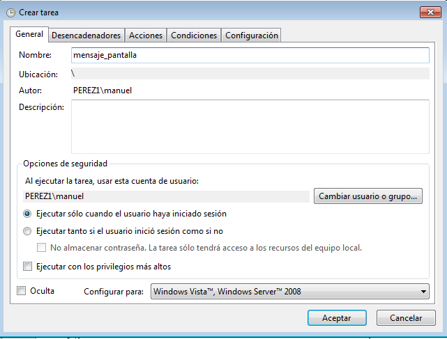

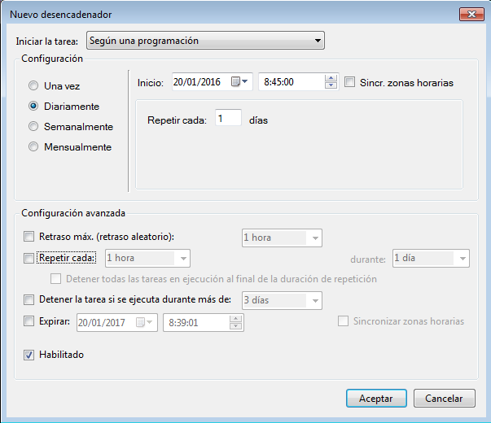

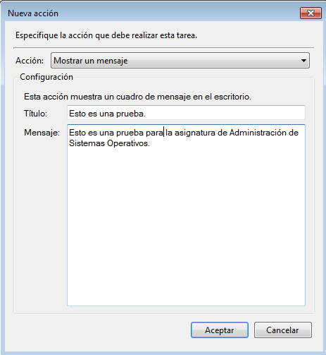

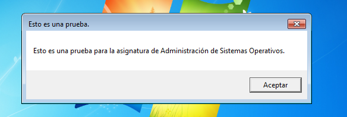

### 2.4 Tarea asíncrona

Y por último, realizamos la configuración de una tarea programada asíncrona que iniciará el desfragmentador del disco cada cierto tiempo:

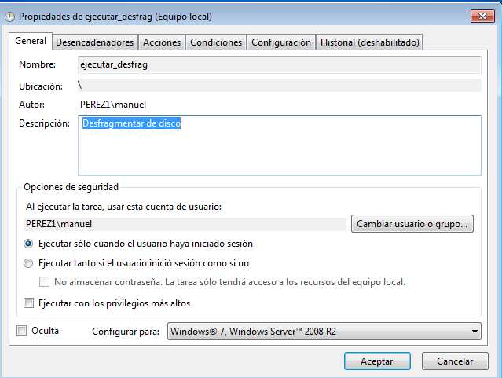

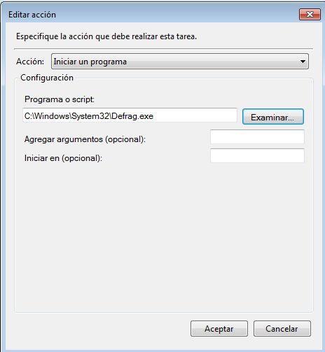

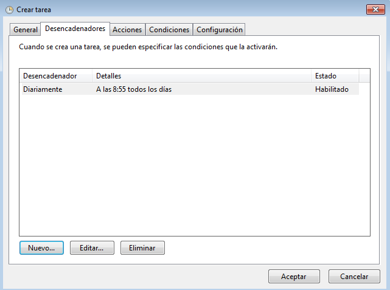

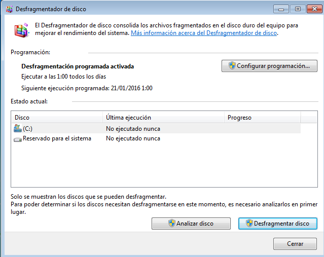
