# Puppet en Debian - Lubuntu (Linux)

## 1. Introducción

Puppet es una herramienta diseñada para administrar la configuración de sistemas Unix-like y de Microsoft Windows de forma declarativa.

En esta práctica, he implementado el servicio Puppet (servidor y cliente) en máquinas reales. Un servidor (configurado en remoto a través de ssh) y un cliente (un ordenador del aula).

Las direcciones IP de las máquinas en este caso serán:

* Leela (servidor): 172.20.1.2
* PC04 (aula108): 172.18.4.0

## 2. Instalación y configuración del SERVER

Como he dicho en la introducción, accedemos al servidor leela desde mi propio ordenador de clase para realizar las configuraciones oportunas. En primer lugar, modificaremos el fichero `/etc/hosts` añadiendole la línea correspondiente al cliente pc04:

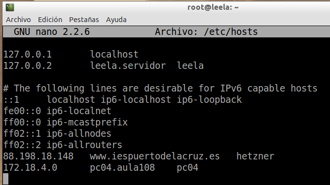

Hacemos ping a la máquina pc04:

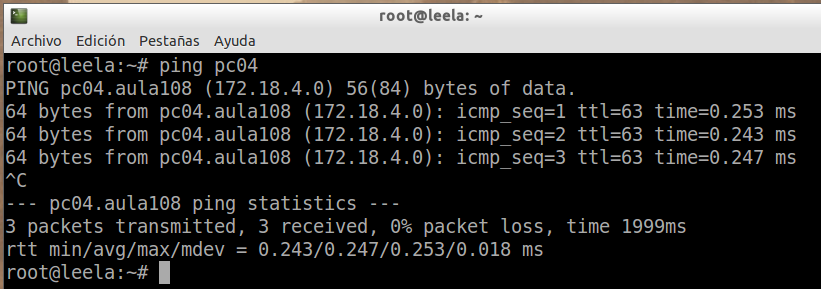

### Primera versión del fichero pp

Instalamos el paquete del servidor Puppet:

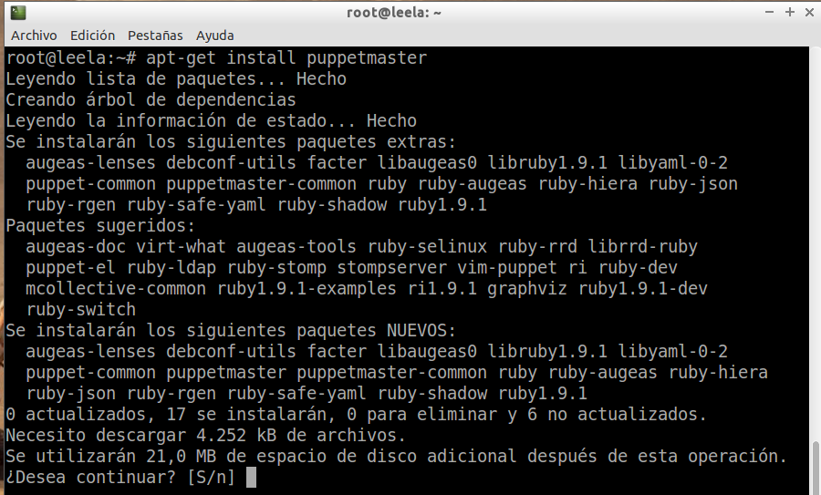

Y creamos las siguientes carpetas y ficheros necesarios para la configuración:

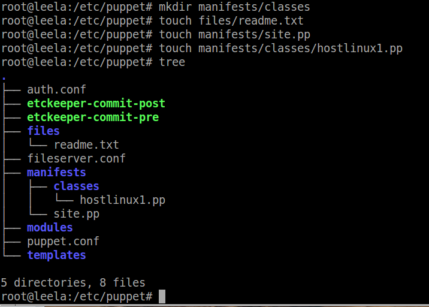

A continuación, modificamos el fichero site.pp:

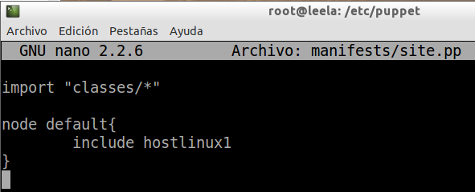

Y modificamos también el contenido del fichero hostlinux1.pp:

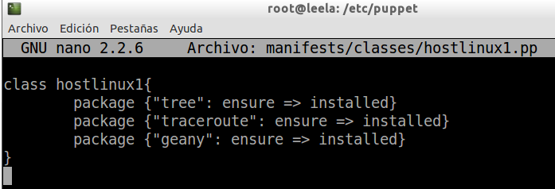

Y por último reiniciamos el servicio en el servidor:

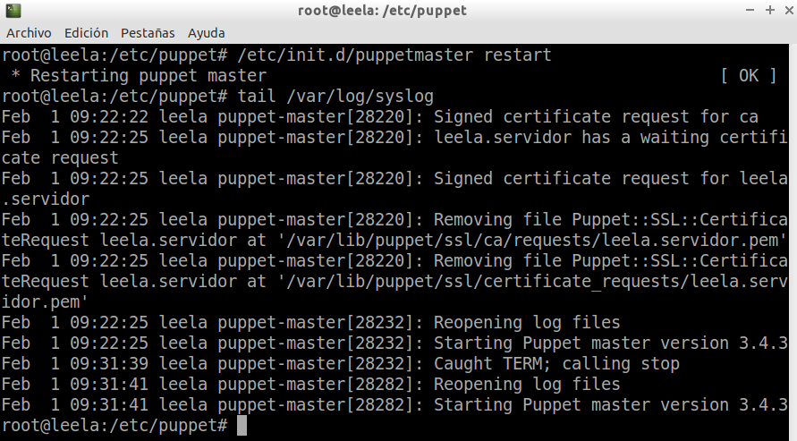

## 3. Instalación y configuración del CLIENTE

Antes que nada modificamos el fichero `/etc/hosts` y le añadimos la línea correspondiente al servidor:

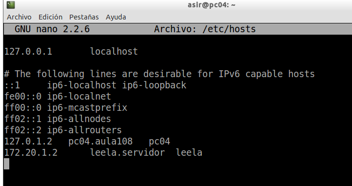

Ahora procederemos a configurar la máquina cliente (pc04). En primer lugar instalamos el servicio con el comando `apt-get install puppet`. Una vez instalado, el cliente puppet debe ser informado de quién será su master. Entonces añadimos en el fichero `/etc/puppet/puppet.conf` la línea `server=leela.servidor`:

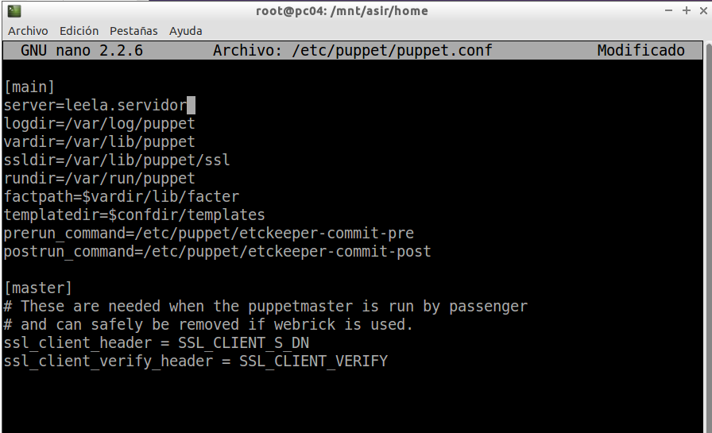

Por último, elimino los paquetes que instalará el servidor de Puppet en el cliente para realizar la comprobación:

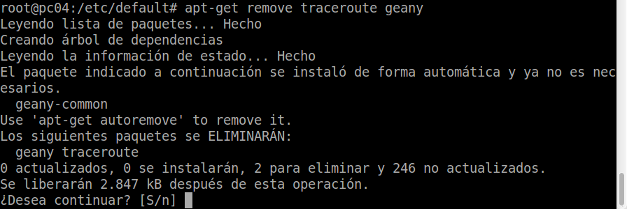

Y reinicio el servicio: `/etc/init.d/puppet restart`

> NOTA:
> Antes de continuar con los intercambios de los certificados, desactivamos el cortafuegos en el servidor leela y cambiamos el paquete de puppetmaster por puppetserver, es decir, desintalamos el paquete puppetmaster e instalamos el paquete puppetserver en el servidor. Y realizamos las mismas configuraciones anteriores.
> Si nos da error en los permisos, lo solucionamos dando permisos al directorio puppet en el master y reiniciando el servicio.

## 4. Aceptar certificado

En este apartado, se realizará el intercambio de certificados entre cliente y servidor. En primer lugar vamos al servidor y consultamos las peticiones pendientes de unión al master:

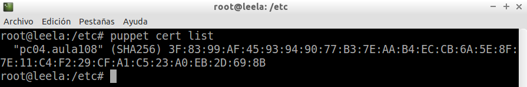

Y a continuación, aceptamos el nuevo cliente desde el master:

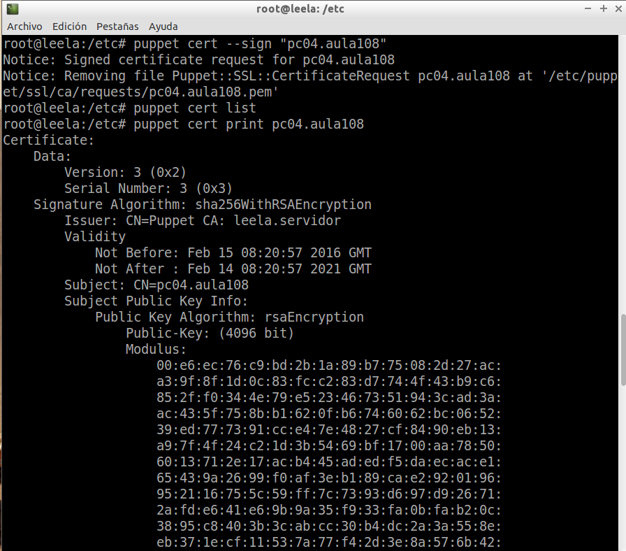

## 5. Segunda versión del fichero ".pp"

Para realizar la prueba, vamos a utilizar un fichero que llamaremos `hostlinux2.pp` que tendrá el siguiente contenido:

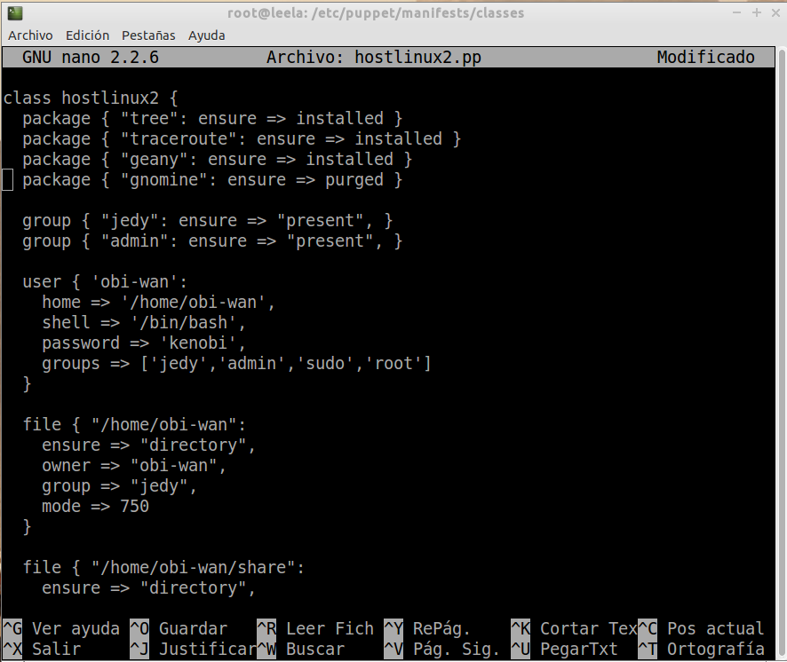

Y modificamos el fichero `site.pp`:

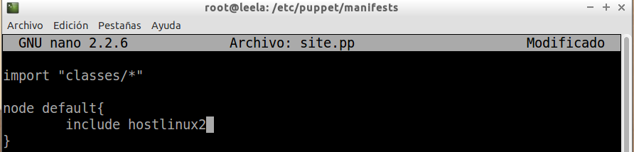

Ahora ejecutamos el comando `puppet agent --test` en el cliente para traer las configuraciones:

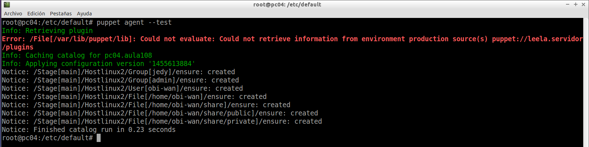

Y comprobamos que efectivamente se crearon los usuarios:

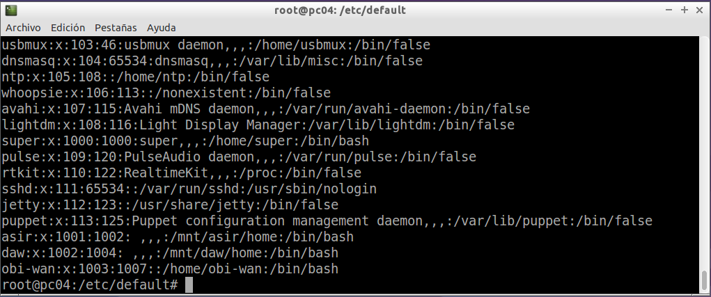

## 6. Cliente puppet Windows

En primer lugar nos descargaremos puppet en el cliente Windows 7 y editaremos el fichero `hosts` tanto en el servidor como en el cliente como corresponda en cada caso.

Ahora por último vamos a llevar la configuración de puppet a un cliente Windows 7. En el master crearemos un fichero `hostwindows1.pp` con el siguiente contenido:

```
class hostwindows1 {
  user { 'darth-sidius':
    ensure => 'present',
    groups => ['Administradores']
  }

  user { 'darth-maul':
    ensure => 'present',
    groups => ['Usuarios']
  }
}
```

Y modificamos el fichero `site.pp`:

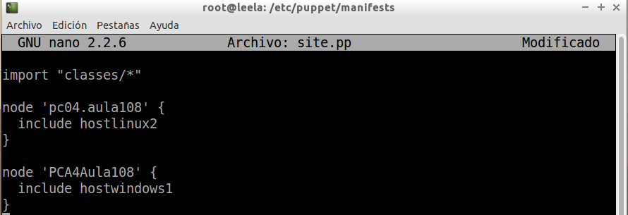

Finalmente, después del correspondiente intercambio de certificados, nos traemos las configuraciones al cliente:

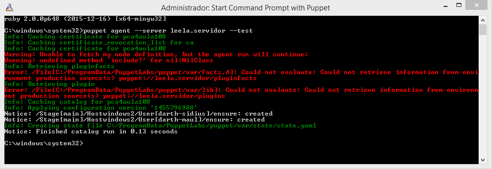

Y efectivamente se han creado los usuarios en el sistema:

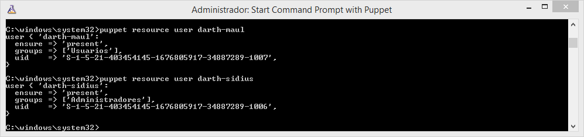
