# 1. Introducción

```
    Vagrant es una herramienta para la creación y configuración de entornos 
    de desarrollo virtualizados.

    Originalmente se desarrolló para VirtualBox y sistemas de configuración tales 
    como Chef, Salt y Puppet. Sin embargo desde la versión 1.1 Vagrant es 
    capaz de trabajar con múltiples proveedores, como VMware, Amazon EC2, LXC, 
    DigitalOcean, etc.2

    Aunque Vagrant se ha desarrollado en Ruby se puede usar en multitud de 
    proyectos escritos en otros lenguajes.
```

# 2. Primeros pasos

## 2.1 Instalar

Para instalar Vagrant, nos descargamos el paquete Vagrant-deb que esta en el servidor Leela y con ayuda del profesor (ya que no conocemos la clave de root del ordenador) lo instalaremos.

## 2.2 Proyecto

Creamos un directorio para nuestro proyecto vagrant y lo inicializamos.

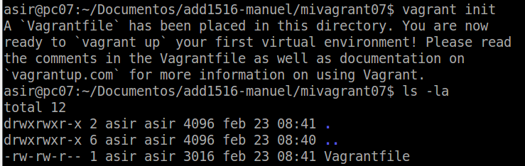

## 2.3 Imagen, caja o box

Ahora necesitamos obtener una imagen de un sistema operativo:

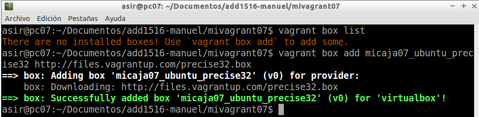

Para usar la caja de nuestro proyecto modificamos el fichero `Vagranfile` de la carpeta de dicho proyecto y cambiamos la línea de `config.vm.box`:

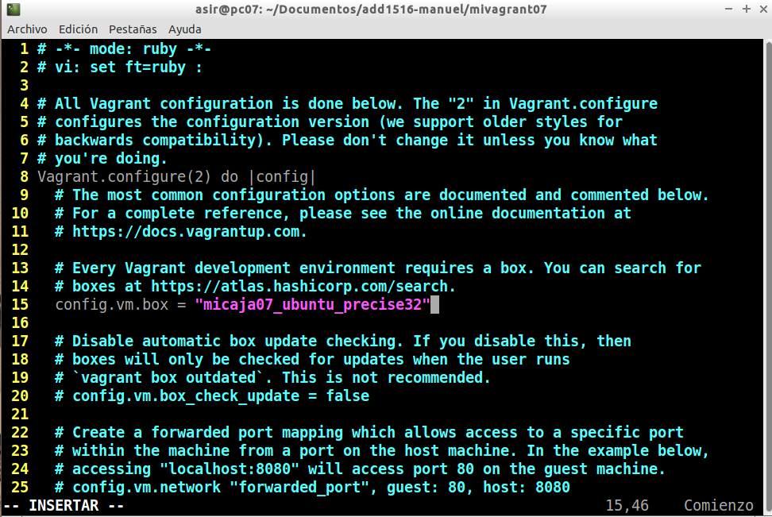 

## 2.4 Iniciar la máquina

A continuación, vamos a iniciar la máquina virtual creada con Vagrant:

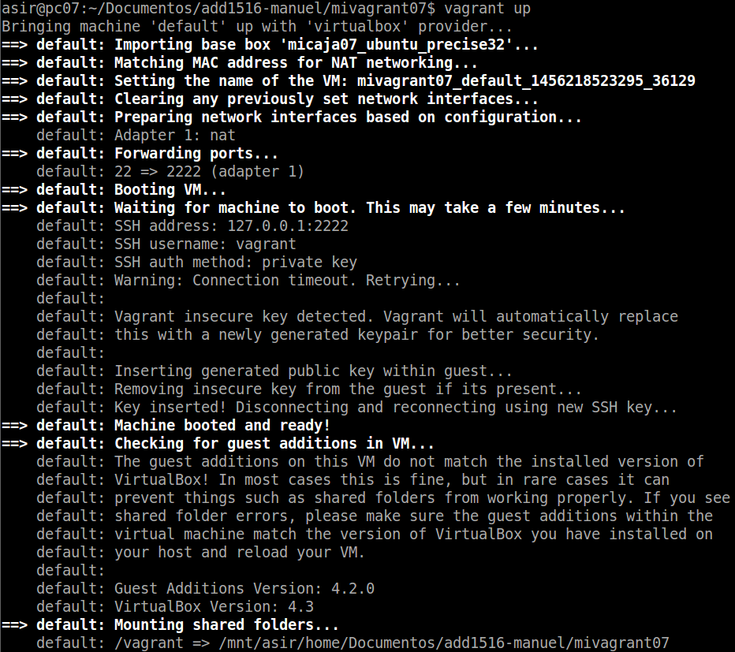

Y luego utilizamos el comando `vagrant ssh` para conectar con nuestra máquina:

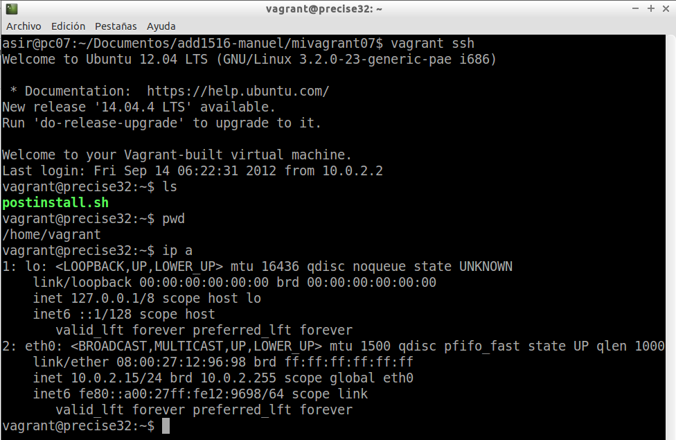

Utilizando los comandos de vagrant vemos que la máquina esta "corriendo":

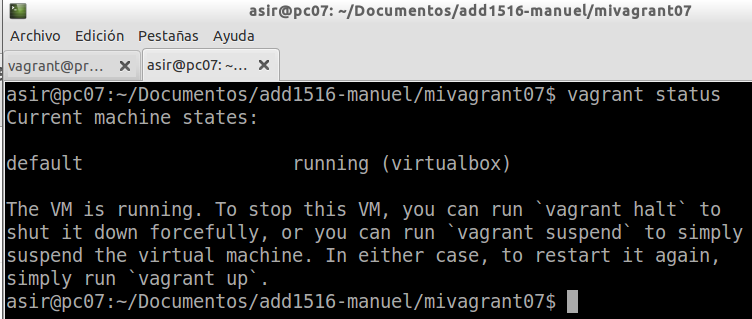

Otros comandos:

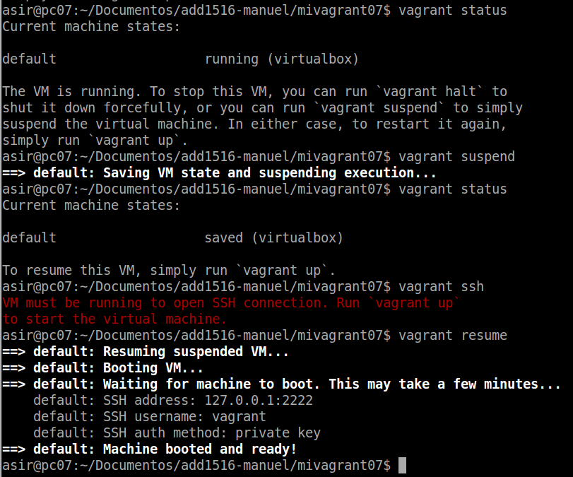

# 3. Configuración

## 3.1 Carpetas sincronizadas

> La carpeta del proyecto que contiene el Vagrantfile comparte los archivos entre el sistema anfitrión y el virtualizado, esto nos permite compartir archivos fácilmente entre los ambientes.

## 3.2 Redireccionamiento de los puertos

Uno de los casos más comunes cuando tenemos una máquina virtual es la situación que estamos trabajando con proyectos enfocados a la web, y para acceder a las páginas no es lo más cómodo tener que meternos por terminal al ambiente virtual y llamarlas desde ahí, aquí entra en juego el enrutamiento de puertos.

Modificamos el fichero `Vagrantfile` añadiendo la siguiente línea:

`config.vm.network :forwarded_port, host: 4567, guest: 80`

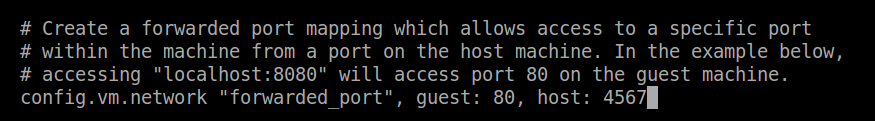

Luego refrescamos la máquina con el comando `vagrant reload`:

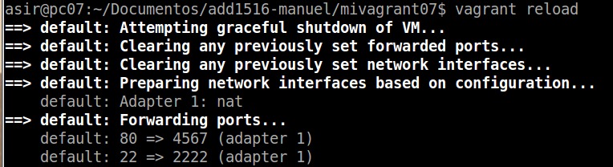

Y por último nos dirigimos al navegador y colocamos la dirección ip seguido del puerto:

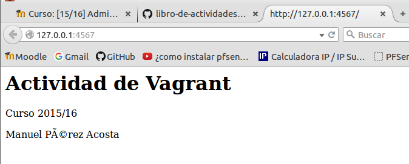

# 4. Suministro mediante Puppet

Creamos la carpeta manifests y el fichero manifest.pp. Añadimos la configuración al fichero Vagrantfile de la siguiente manera:

```
  config.vm.provision :puppet do |puppet|
    puppet.manifest_file = "my_manifests.pp"
  end
```

Y vemos como nos aprovisiona con los paquetes que he reflejado en el fichero:

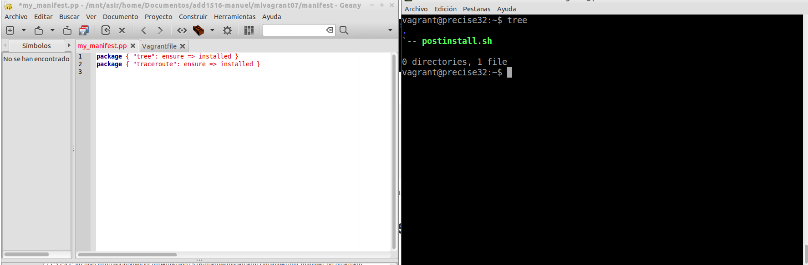

# 5. Nuestra caja

Para crear nuestra propia caja, seguimos los siguientes pasos:

1. Entramos en la máquina virtual que queremos comvertir a box de vagrant.

2. Ejecutamos los siguientes comandos:

> useradd -m vagrant
> su - vagrant
> mkdir .ssh
> wget https://raw.githubusercontent.com/mitchellh/vagrant/master/keys/vagrant.pub -O .ssh/authorized_keys
> chmod 700 .ssh 
> chmod 600 .ssh/authorized_keys

3. Concedemos permisos al usuario:

> visudo
> vagrant ALL=(ALL) NOPASSWD: ALL

4. Y por último, apagamos la máquina virtual y accedemos a la consola de la máquina real. Ejecutamos los siguientes comandos:

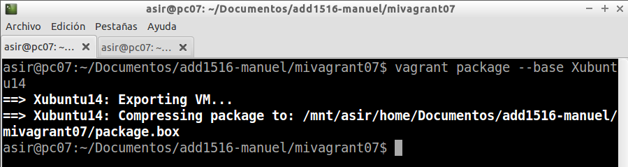

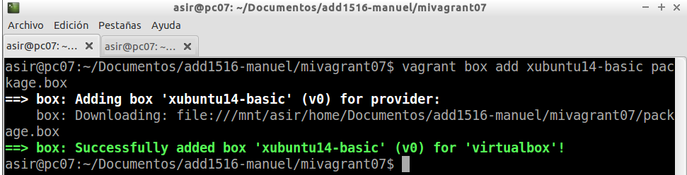

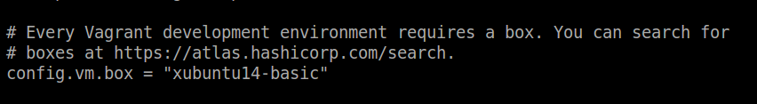

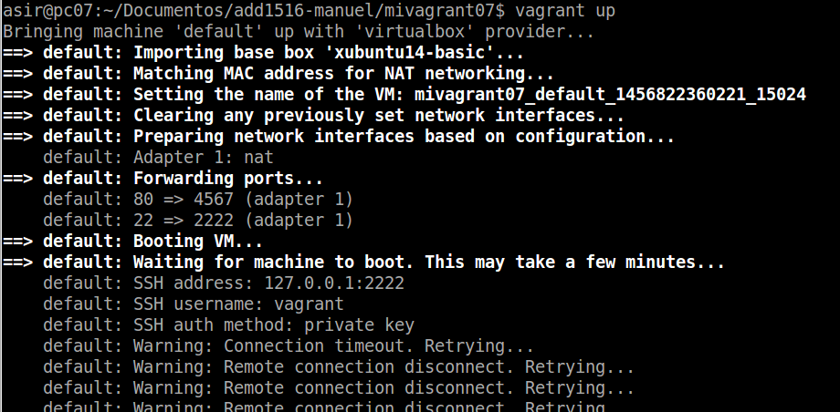

> NOTA: Debe haber algún error con los certificados ssh, por eso no puedo iniciar.
